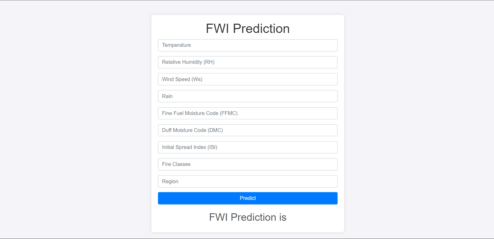

# Forest Fire Prediction using Algerian Forest Fire Dataset

## Project Overview

This project involves predicting fire risk using weather data from two regions in Algeria. The dataset contains information collected from June 2012 to September 2012 for the Bejaia and Sidi Bel-abbes regions. The primary goal is to predict whether a fire will occur based on various weather attributes using multiple regression models.

## Dataset Information

- **Regions Covered:** 
  - Bejaia (northeast Algeria)
  - Sidi Bel-abbes (northwest Algeria)
- **Number of Instances:** 244 (122 instances per region)
- **Time Period:** June 2012 - September 2012
- **Attributes:**
  - 11 input attributes
  - 1 output attribute (class)
- **Class Distribution:**
  - Fire: 138 instances
  - No Fire: 106 instances

## Data Analysis and Feature Engineering

Performed Exploratory Data Analysis (EDA) to understand the dataset and feature engineering to analyze correlations between features. This step involved:

- Identifying important features
- Analyzing feature correlations
- Cleaning and preparing data for modeling

## Model Training

Trained multiple regression models to predict fire risk:

- **Linear Regression**
- **Lasso Regression**
- **Ridge Regression**
- **ElasticNet Regression**

## Hyperparameter Tuning and Cross-Validation

Used the following techniques for hyperparameter tuning and cross-validation:

- **LassoCV** for Lasso Regression
- **RidgeCV** for Ridge Regression
- **ElasticNetCV** for ElasticNet Regression

Selected Ridge Regression as the final model due to its outstanding accuracy and performance.

## Web Application

Developed a web application integrated with the Ridge Regression model to predict the Fire Weather Index (FWI) based on user input data. The web application provides an interactive interface for users to enter weather parameters and receive predictions.

## Getting Started

To run this project locally:

1. Clone the repository:
    ```bash
    git clone https://github.com/yourusername/mobile-price-range-predictor.git
    ```
2. Set Up a Virtual Environment (Optional but Recommended):

    It's a good practice to use a virtual environment to manage dependencies for your project, avoiding conflicts with other projects.

    I have used Python 3.10

2. Install the required dependencies:
    ```bash
    pip install -r requirements.txt
    ```
3. Run the Flask application:
    ```bash
    python app.py
    ```
4. Access the web interface at `http://localhost:5000`.

Screenshots




## Contributing

We welcome contributions to improve this project. Please feel free to submit a pull request or raise an issue.

## License

This project is licensed under the MIT License.

---

Thank you for checking out the Mobile Price Range Predictor project! If you have any questions or feedback, please feel free to reach out.

